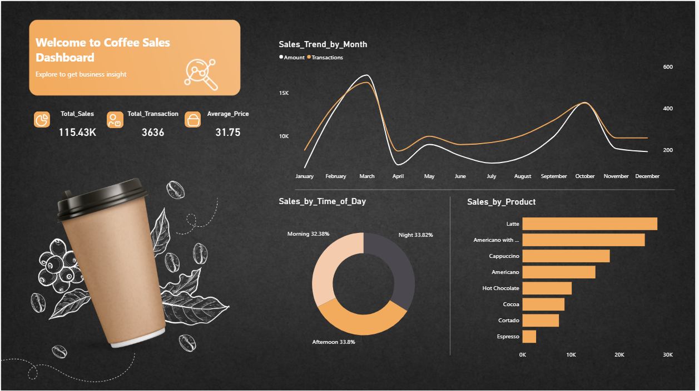

# ☕ Coffee Sales Dashboard (Power BI)

An interactive Power BI dashboard to analyze coffee sales performance, trends, and customer behavior.

## 📊 Dashboard Preview

## 📊 Features

- Monthly Sales Trends
- Total Sales, Transactions & Average Price KPIs
- Sales by Time of Day (Morning, Afternoon, Night)
- Product-wise Sales Analysis
- Clean and aesthetic dashboard design

## 📁 Files Included

- `Dashboard/` → Power BI file (.pbix)
- `Dataset/` → Raw dataset used
- `Images/` → Dashboard screenshots

## 🛠 Tools Used

- Power BI
- Excel (Data Cleaning & Preparation)

## 📌 Key Insights

- Peak sales observed in March & October
- Latte is the top-selling product
- Sales are evenly distributed across time periods

## 🚀 How to Use

1. Download the `.pbix` file
2. Open in Power BI Desktop
3. Explore visuals and insights

## 👩‍💻 Author

**Ashiba B**  
Data Analyst | SQL | Power BI | Excel | Python  

[LinkedIn](https://www.linkedin.com/in/ashiba-data-analyst) | [Email](mailto:ashibab23@gmail.com)
